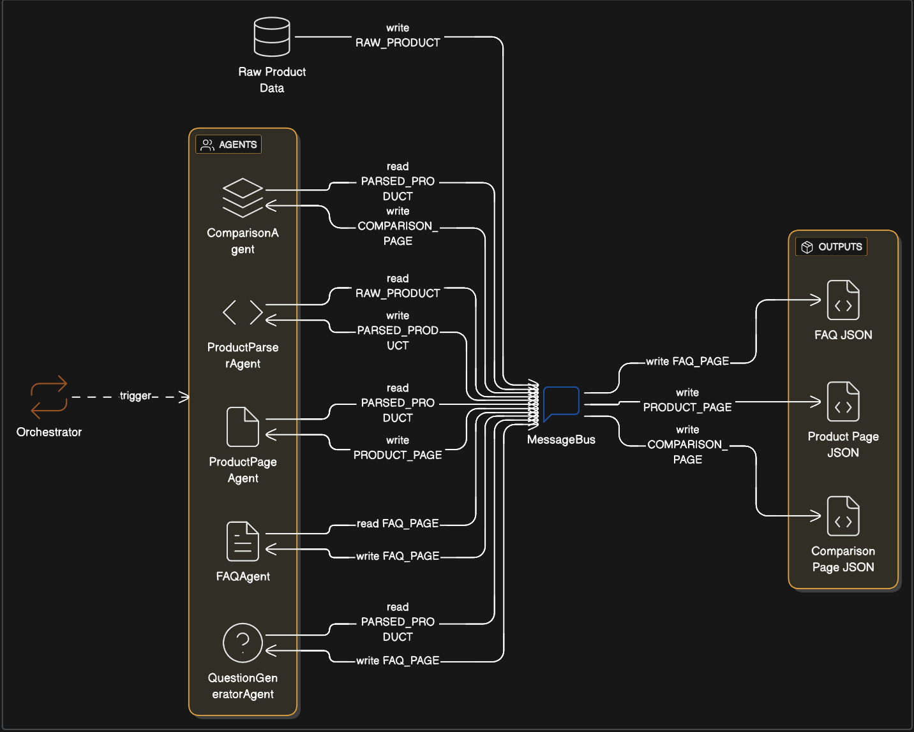

# Multi-Agent Content Generation System

## Overview

This project implements a **true multi-agent content generation system** as part of the Applied AI Engineer assignment.

The system converts structured product data into multiple **machine-readable JSON pages** (FAQ, product page, comparison page) using **independent, autonomous agents**, rather than a single hard-coded pipeline.

The emphasis of this project is on **system architecture and agent autonomy**, not UI or external APIs.


## Problem Understanding

The assignment was designed to evaluate whether a candidate can design a **real multi-agent system**, not just a sequence of functions labeled as agents.

After feedback from the initial submission, the system was redesigned to ensure:

- Agents are autonomous and self-governing  
- Coordination is dynamic and data-driven  
- Execution order is **not hard-coded**  
- Orchestration logic is separated from agent logic  


## High-Level Architecture

The system is composed of three core layers:

1. **Agents** – independent units that perform a single responsibility  
2. **MessageBus** – shared state used for coordination  
3. **Orchestrator** – a generic scheduler with no business logic  

The orchestrator does **not** control execution order.  
Each agent decides when it can act.


## System Architecture




## Agent Responsibilities

Each agent has a **single responsibility** and communicates only through the MessageBus.

| Agent | Responsibility | Consumes | Produces |
|------|---------------|---------|----------|
| ProductParserAgent | Normalize raw product input | `RAW_PRODUCT` | `PARSED_PRODUCT` |
| QuestionGeneratorAgent | Generate user-style questions | `PARSED_PRODUCT` | `QUESTIONS` |
| FAQAgent | Build FAQ content | `PARSED_PRODUCT`, `QUESTIONS` | `FAQ_PAGE` |
| ProductPageAgent | Build product description | `PARSED_PRODUCT` | `PRODUCT_PAGE` |
| ComparisonAgent | Generate comparison content | `PARSED_PRODUCT` | `COMPARISON_PAGE` |

Agents never call each other directly.


## Agent Autonomy Model

Each agent implements two methods:

- `can_act(bus)`  
- `act(bus)`  

An agent:
- checks the MessageBus for required inputs
- decides independently whether it can act
- publishes its output back to the MessageBus

There is **no fixed execution order** such as:
> “Run parser → then FAQ → then comparison”

Execution order **emerges naturally** based on data availability.


## Message-Based Coordination

The **MessageBus** acts as shared state:

- Agents publish outputs as named messages
- Other agents react when required messages appear
- No global variables
- No direct agent-to-agent dependency

This design allows agents to be added or removed without changing orchestration logic.


## Orchestrator Design

The orchestrator is intentionally minimal.

Its responsibilities are:
- iterate over available agents
- allow an agent to act if `can_act()` returns true
- continue until no agent can make progress

The orchestrator does **not**:
- contain content logic
- manage dependencies manually
- enforce execution order


## Outputs

The system produces deterministic JSON outputs:

- `output/faq.json`
- `output/product_page.json`
- `output/comparison_page.json`

All outputs are:
- machine-readable
- reproducible
- generated without randomness or external APIs


## How to Run

From the project root:

```bash
python3 orchestrator.py

