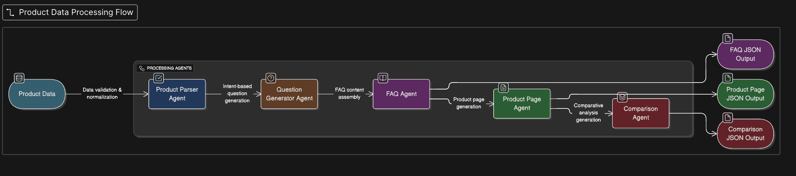

# Multi-Agent Content Generation System

This project implements a modular, multi-agent automation system that generates
structured content pages (FAQ, Product Page, Comparison Page) from a fixed
product dataset.

The focus of this assignment is system design, clear agent boundaries,
and automation flow rather than UI or domain expertise.

## System Architecture Diagram


 

## Key Design Decisions

- Each agent has a single responsibility
- Reusable logic is implemented as stateless logic blocks
- Page structure is defined using explicit templates
- A centralized orchestrator controls execution
- All outputs are machine-readable JSON

## How to Run

Run the orchestrator script:

```bash
python3 orchestrator.py